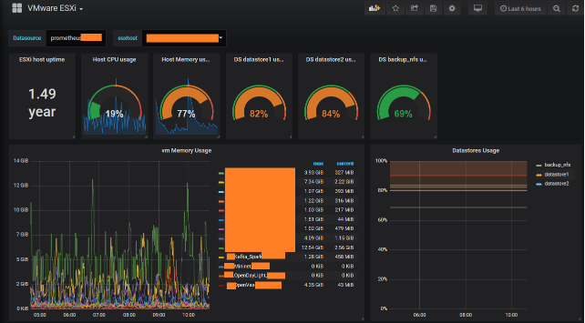
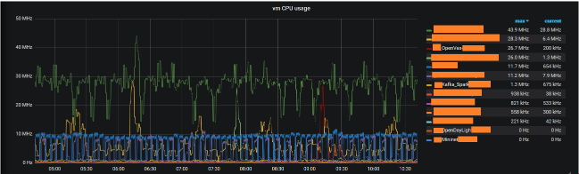

# VMWARE ESXi Grafana charts via Prometheus

This Grafana chart is designed for standalone VMWare ESXi.
Test ESXi software levels: 5.0,5.1 and 6.5.

# Grafana dashboard:

   

 

   

# Requirements and setup

Requires to have compiled exporter available at:
https://github.com/devinotelecom/prometheus-vmware-exporter

Separate exporter must be run for each of the monitored ESXi hosts. In the examples there are two SystemD services which run on the same machine as Prometheus:
esxexporter01 - scrapes metrics from esx01.mydomain.com and presents metrics locally on port 9611
esxexporter02 - scrapes metrics from esx02.mydomain.com and presents metrics locally on port 9612

Host names must be resolvable - attached an example /etc/hosts file.

prometheus.yml - Prometheus example configuration to scrape metrics from both exporters.

Grafana dashboard definition: "VMWare ESXi Dashboard.json"
